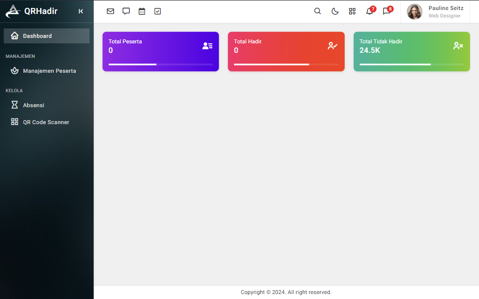
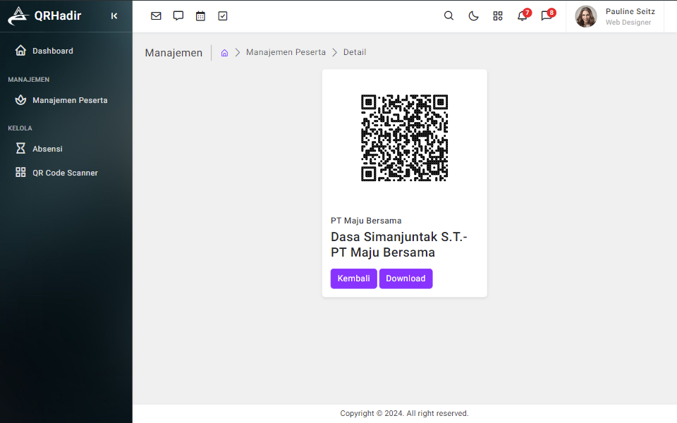
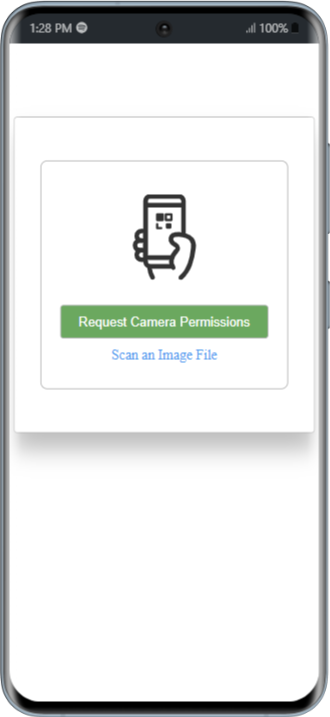

# Aplikasi Absensi dengan QR Code Scanner

## Deskripsi

Aplikasi ini dirancang untuk memudahkan pengelolaan tamu dengan fitur-fitur seperti:

-   Dashboard informatif untuk melihat rekapitulasi data tamu.
-   Manajemen data tamu yang efisien (tambah, edit, hapus).
-   Pengelolaan absensi tamu dengan detail waktu check-in dan check-out.
-   Fitur QR Code Scanner untuk verifikasi tamu yang cepat dan efisien.

## Fitur Utama

-   **Dashboard**: Menampilkan informasi rekapitulasi jumlah tamu, jumlah kehadiran, dan statistik lainnya.
    
-   **Manajemen Tamu**: Memungkinkan admin untuk menambah, mengedit, dan menghapus data tamu, serta melihat QR Code yang terkait dengan setiap tamu.
    
-   **Kelola Absensi**: Mengelola catatan kehadiran tamu dengan detail tanggal dan waktu check-in/check-out.
    
-   **QR Code Scanner**: Memungkinkan tamu untuk melakukan pemindaian QR Code untuk verifikasi kehadiran.
    

## Halaman

1. **Halaman Dashboard**: Antarmuka utama untuk admin dalam mengelola dan memantau aplikasi.
2. **Halaman Manajemen Tamu**: Mengelola data tamu dan QR Code.
3. **Halaman Kelola Absensi**: Mengelola catatan kehadiran tamu.
4. **Halaman QR Code Scanner**: Tempat tamu memindai QR Code untuk verifikasi.

## Kontak

-   Email: teamcreativecode5@gmail.com
-   Telepon: +62 851-6787-5001
-   Lokasi: Pekanbaru, Riau

## Hak Cipta

Copyright © 2025 .CreativeCode5

## Presentasi

Dipersembahkan oleh CreativeCode.
